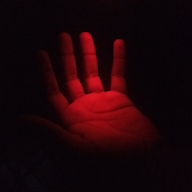

<!-- ========================================================= -->
<!-- Decorative Header -->
<!-- ========================================================= -->

  

<!-- Intro with avatar + bio, no table borders -->

  

<h3>Clean architecture, delight</h3>

  Hi, I’m <b>Goodness Wema</b> — a private software engineer from Nairobi. I build robust backends,
  full‑stack apps, and delightful developer experiences. I also dabble in <b>space science</b>,
  <b>remote sensing</b>, and <b>GIS</b>.

  • Exploring <b>AWS/Azure</b> and practical <b>AI/ML</b> integrations 
  • Love building <b>REST/GraphQL</b> services, event‑driven systems, and tools for devs 
  • Open to <b>collabs</b> and interesting contracts

<!-- Social & Contact Buttons (external SVGs with hover, no sweeps) -->

  
  
  

<!-- Short Bio -->

  Nairobi‑based software engineer focused on backend systems, full‑stack apps, and developer experience. I also dabble in <b>space science</b>, <b>remote sensing</b>, and <b>GIS</b>. I enjoy pragmatic design, sensible abstractions, and shipping high‑quality work.

<!-- Quick Highlights -->

  • Exploring <b>AWS/Azure</b> and practical <b>AI/ML</b> integrations 
  • Love building <b>REST/GraphQL</b> services, event‑driven systems, and tools for devs 
  • Open to <b>collabs</b> and interesting contracts 
  • Fun fact: epic game OSTs fuel my deep work 🎧

<!-- Interdisciplinary Focus (animated, oval pills) -->
<h3 align="center">Interdisciplinary Focus</h3>

  <svg width="820" height="44" viewBox="0 0 820 44" xmlns="http://www.w3.org/2000/svg">
    <defs>
      <linearGradient id="pillGrad" x1="0%" y1="0%" x2="100%" y2="100%">
        <stop offset="0%" stop-color="#1f1f1f"/>
        <stop offset="100%" stop-color="#000000"/>
      </linearGradient>
      <filter id="pillShadow" x="-50%" y="-50%" width="200%" height="200%">
        <feDropShadow dx="0" dy="2" stdDeviation="2" flood-color="#000" flood-opacity="0.6"/>
      </filter>
    </defs>
    <g transform="translate(0,2)">
      <g filter="url(#pillShadow)" transform="translate(0,0)"><rect x="0" y="0" rx="20" ry="20" width="150" height="40" fill="url(#pillGrad)"/><text x="18" y="26" font-family="Segoe UI, Roboto, Helvetica, Arial" font-weight="600" font-size="14" fill="#ffffff">SPACE SCIENCE</text></g>
      <g filter="url(#pillShadow)" transform="translate(160,0)"><rect x="0" y="0" rx="20" ry="20" width="180" height="40" fill="url(#pillGrad)"/><text x="18" y="26" font-family="Segoe UI, Roboto, Helvetica, Arial" font-weight="600" font-size="14" fill="#ffffff">ORBITS | SAT DATA</text></g>
      <g filter="url(#pillShadow)" transform="translate(350,0)"><rect x="0" y="0" rx="20" ry="20" width="170" height="40" fill="url(#pillGrad)"/><text x="18" y="26" font-family="Segoe UI, Roboto, Helvetica, Arial" font-weight="600" font-size="14" fill="#ffffff">REMOTE SENSING</text></g>
      <g filter="url(#pillShadow)" transform="translate(530,0)"><rect x="0" y="0" rx="20" ry="20" width="140" height="40" fill="url(#pillGrad)"/><text x="24" y="26" font-family="Segoe UI, Roboto, Helvetica, Arial" font-weight="600" font-size="14" fill="#ffffff">SAR | OPTICAL</text></g>
      <g filter="url(#pillShadow)" transform="translate(680,0)"><rect x="0" y="0" rx="20" ry="20" width="120" height="40" fill="url(#pillGrad)"/><text x="48" y="26" font-family="Segoe UI, Roboto, Helvetica, Arial" font-weight="600" font-size="14" fill="#ffffff">GIS</text></g>
    </g>
  </svg>

<!-- --------------------------------------------------------- -->
<!-- Toolbox / Tech -->
<!-- --------------------------------------------------------- -->
<h3 align="center">Core Stack</h3>

  

  <svg width="760" height="70" viewBox="0 0 760 70" xmlns="http://www.w3.org/2000/svg" role="img" aria-label="Core stack logos">
    <defs>
      <filter id="iconShadow" x="-50%" y="-50%" width="200%" height="200%">
        <feDropShadow dx="0" dy="2" stdDeviation="2" flood-color="#000" flood-opacity="0.6"/>
      </filter>
    </defs>
    <g transform="translate(10,10)">
      <g filter="url(#iconShadow)" transform="translate(0,0)">
        <image href="https://skillicons.dev/icons?i=python" width="48" height="48"/>
        <animateTransform attributeName="transform" type="translate" values="0,0;0,-3;0,0" dur="3s" repeatCount="indefinite" begin="0s"/>
      </g>
      <g filter="url(#iconShadow)" transform="translate(80,0)">
        <image href="https://skillicons.dev/icons?i=ts" width="48" height="48"/>
        <animateTransform attributeName="transform" type="translate" values="0,0;0,-3;0,0" dur="3s" repeatCount="indefinite" begin="0.2s"/>
      </g>
      <g filter="url(#iconShadow)" transform="translate(160,0)">
        <image href="https://skillicons.dev/icons?i=nodejs" width="48" height="48"/>
        <animateTransform attributeName="transform" type="translate" values="0,0;0,-3;0,0" dur="3s" repeatCount="indefinite" begin="0.4s"/>
      </g>
      <g filter="url(#iconShadow)" transform="translate(240,0)">
        <image href="https://skillicons.dev/icons?i=react" width="48" height="48"/>
        <animateTransform attributeName="transform" type="translate" values="0,0;0,-3;0,0" dur="3s" repeatCount="indefinite" begin="0.6s"/>
      </g>
      <g filter="url(#iconShadow)" transform="translate(320,0)">
        <image href="https://skillicons.dev/icons?i=docker" width="48" height="48"/>
        <animateTransform attributeName="transform" type="translate" values="0,0;0,-3;0,0" dur="3s" repeatCount="indefinite" begin="0.8s"/>
      </g>
      <g filter="url(#iconShadow)" transform="translate(400,0)">
        <image href="https://skillicons.dev/icons?i=mongodb" width="48" height="48"/>
        <animateTransform attributeName="transform" type="translate" values="0,0;0,-3;0,0" dur="3s" repeatCount="indefinite" begin="1.0s"/>
      </g>
      <g filter="url(#iconShadow)" transform="translate(480,0)">
        <image href="https://skillicons.dev/icons?i=postgres" width="48" height="48"/>
        <animateTransform attributeName="transform" type="translate" values="0,0;0,-3;0,0" dur="3s" repeatCount="indefinite" begin="1.2s"/>
      </g>
      <g filter="url(#iconShadow)" transform="translate(560,0)">
        <image href="https://skillicons.dev/icons?i=linux" width="48" height="48"/>
        <animateTransform attributeName="transform" type="translate" values="0,0;0,-3;0,0" dur="3s" repeatCount="indefinite" begin="1.4s"/>
      </g>
    </g>
  </svg>

<!-- Separator -->

  

<!-- --------------------------------------------------------- -->
<!-- What I Do / Services -->
<!-- --------------------------------------------------------- -->
<h3 align="center">What I Do</h3>

  <svg width="880" height="44" viewBox="0 0 880 44" xmlns="http://www.w3.org/2000/svg">
    <defs>
      <linearGradient id="svcgrad" x1="0%" y1="0%" x2="100%" y2="100%">
        <stop offset="0%" stop-color="#1f1f1f"/>
        <stop offset="100%" stop-color="#000000"/>
      </linearGradient>
      <filter id="svcShadow" x="-50%" y="-50%" width="200%" height="200%">
        <feDropShadow dx="0" dy="2" stdDeviation="2" flood-color="#000" flood-opacity="0.6"/>
      </filter>
    </defs>
    <g transform="translate(0,2)">
      <g filter="url(#svcShadow)" transform="translate(0,0)"><rect x="0" y="0" rx="20" ry="20" width="170" height="40" fill="url(#svcgrad)"/><text x="20" y="26" font-family="Segoe UI, Roboto, Helvetica, Arial" font-weight="600" font-size="14" fill="#ffffff">Backend APIs</text></g>
      <g filter="url(#svcShadow)" transform="translate(180,0)"><rect x="0" y="0" rx="20" ry="20" width="160" height="40" fill="url(#svcgrad)"/><text x="18" y="26" font-family="Segoe UI, Roboto, Helvetica, Arial" font-weight="600" font-size="14" fill="#ffffff">Microservices</text></g>
      <g filter="url(#svcShadow)" transform="translate(350,0)"><rect x="0" y="0" rx="20" ry="20" width="140" height="40" fill="url(#svcgrad)"/><text x="28" y="26" font-family="Segoe UI, Roboto, Helvetica, Arial" font-weight="600" font-size="14" fill="#ffffff">Full‑Stack</text></g>
      <g filter="url(#svcShadow)" transform="translate(500,0)"><rect x="0" y="0" rx="20" ry="20" width="210" height="40" fill="url(#svcgrad)"/><text x="16" y="26" font-family="Segoe UI, Roboto, Helvetica, Arial" font-weight="600" font-size="14" fill="#ffffff">Databases (SQL/NoSQL)</text></g>
      <g filter="url(#svcShadow)" transform="translate(720,0)"><rect x="0" y="0" rx="20" ry="20" width="150" height="40" fill="url(#svcgrad)"/><text x="52" y="26" font-family="Segoe UI, Roboto, Helvetica, Arial" font-weight="600" font-size="14" fill="#ffffff">Cloud</text></g>
    </g>
  </svg>

<!-- Featured Projects (Pinned) -->
<h3 align="center">Featured Projects</h3>

  
  

<!-- More details -->

  
<b>More about me</b>

   
  <ul>
    <li>Languages: TypeScript, JavaScript, Python, C/C++, C#</li>
    <li>Frameworks: Node.js, Express, React, FastAPI</li>
    <li>Data: MySQL, PostgreSQL, Redis, Prisma/ORMs</li>
    <li>Infra: Docker, GitHub Actions, Vercel, basic AWS/Azure</li>
    <li>Interests: game mechanics, procedural gen, graphics experiments</li>
  </ul>

<!-- Certifications -->
<h3 align="center">Certifications</h3>

  <svg width="880" height="44" viewBox="0 0 880 44" xmlns="http://www.w3.org/2000/svg">
    <defs>
      <linearGradient id="certgrad" x1="0%" y1="0%" x2="100%" y2="100%">
        <stop offset="0%" stop-color="#1f1f1f"/>
        <stop offset="100%" stop-color="#000000"/>
      </linearGradient>
      <filter id="certShadow" x="-50%" y="-50%" width="200%" height="200%">
        <feDropShadow dx="0" dy="2" stdDeviation="2" flood-color="#000" flood-opacity="0.6"/>
      </filter>
      
    </defs>
    <g transform="translate(0,2)">
      <g filter="url(#certShadow)" transform="translate(0,0)"><rect x="0" y="0" rx="20" ry="20" width="210" height="40" fill="url(#certgrad)"/><text x="16" y="26">ALX Software Eng</text></g>
      <g filter="url(#certShadow)" transform="translate(220,0)"><rect x="0" y="0" rx="20" ry="20" width="280" height="40" fill="url(#certgrad)"/><text x="10" y="26">AWS Cloud Practitioner (in progress)</text></g>
      <g filter="url(#certShadow)" transform="translate(510,0)"><rect x="0" y="0" rx="20" ry="20" width="260" height="40" fill="url(#certgrad)"/><text x="12" y="26">Azure Fundamentals (in progress)</text></g>
    </g>
  </svg>

<!-- --------------------------------------------------------- -->
<!-- Contribution Candy (optional) -->
<!-- --------------------------------------------------------- -->

  
<b>Contribution candy</b> (fun visuals)

   
  

    <em>Note: Some visuals depend on external generators and may need setup in your profile repo.</em>
  

  

    
  

<!-- --------------------------------------------------------- -->
<!-- Call to Action -->
<!-- --------------------------------------------------------- -->
<h3 align="center">Let’s build something great</h3>

  I’m open to collaborations, private contracts, and interesting conversations. Reach out — I’d love to chat!

  
  
  

<!-- Decorative Footer -->

  

