<!-- ========================================================= -->
<!-- Decorative Header -->
<!-- ========================================================= -->

  

<!-- Intro with avatar + bio in two columns -->
<table>
  <tr>
    <td align="center" width="35%">
      
    </td>
    <td>
      <h2>Clean architecture, delight</h2>
      

        Hi, I’m <b>Goodness Wema</b> — a private software engineer from Nairobi. I build robust backends,
        full‑stack apps, and delightful developer experiences. I also dabble in <b>space science</b>,
        <b>remote sensing</b>, and <b>GIS</b>.
      

      

        • Exploring <b>AWS/Azure</b> and practical <b>AI/ML</b> integrations 
        • Love building <b>REST/GraphQL</b> services, event‑driven systems, and tools for devs 
        • Open to <b>collabs</b> and interesting contracts 
      

      <!-- Social & Contact Buttons (inline SVG, pill shaped, hover scale) -->
      

        <a href="https://x.com/WemaGoodness" title="Follow on X">
          <svg width="240" height="56" viewBox="0 0 260 56" xmlns="http://www.w3.org/2000/svg">
            <defs>
              <clipPath id="pillClipX"><rect x="2" y="2" rx="28" ry="28" width="256" height="52"/></clipPath>
              <linearGradient id="btnGradX" x1="0%" y1="0%" x2="100%" y2="100%">
                <stop offset="0%" stop-color="#1f1f1f"/>
                <stop offset="100%" stop-color="#000000"/>
              </linearGradient>
              <filter id="btnShadowX" x="-50%" y="-50%" width="200%" height="200%">
                <feDropShadow dx="0" dy="3" stdDeviation="3" flood-color="#000" flood-opacity="0.6"/>
              </filter>
            </defs>
            <g filter="url(#btnShadowX)">
              <g id="buttonX" clip-path="url(#pillClipX)">
                <rect x="2" y="2" rx="28" ry="28" width="256" height="52" fill="url(#btnGradX)"/>
                <g transform="translate(18,11)">
                  <circle cx="16" cy="16" r="16" fill="#000" stroke="#2a2a2a"/>
                  <g transform="translate(6,5) scale(0.7)" fill="#fff">
                    <path d="M22.25 0h-4.2L9.65 11.1 3.7 4.25H0l8.1 9.4L0 24h4.2l8.85-10.35L19.3 20.3h3.7l-8.55-9.9L22.25 0z"/>
                  </g>
                  <text x="50" y="20" fill="#ffffff" font-family="Segoe UI, Roboto, Helvetica, Arial, sans-serif" font-size="16" font-weight="600">Follow on X</text>
                </g>
                <rect x="-256" y="2" rx="28" ry="28" width="256" height="52" fill="#ffffff" opacity="0.15">
                  <animate attributeName="x" from="-256" to="256" dur="3.8s" repeatCount="indefinite"/>
                </rect>
              </g>
              <animateTransform xlink:href="#buttonX" attributeName="transform" type="scale" from="1" to="1.04" begin="mouseover" end="mouseout" dur="0.2s"/>
            </g>
          </svg>
        </a>
        <a href="https://www.linkedin.com/in/wema-goodness/" title="Connect on LinkedIn">
          <svg width="260" height="56" viewBox="0 0 260 56" xmlns="http://www.w3.org/2000/svg">
            <defs>
              <clipPath id="pillClipL"><rect x="2" y="2" rx="28" ry="28" width="256" height="52"/></clipPath>
              <linearGradient id="btnGradL" x1="0%" y1="0%" x2="100%" y2="100%">
                <stop offset="0%" stop-color="#1f1f1f"/>
                <stop offset="100%" stop-color="#000000"/>
              </linearGradient>
              <filter id="btnShadowL" x="-50%" y="-50%" width="200%" height="200%">
                <feDropShadow dx="0" dy="3" stdDeviation="3" flood-color="#000" flood-opacity="0.6"/>
              </filter>
            </defs>
            <g filter="url(#btnShadowL)">
              <g id="buttonL" clip-path="url(#pillClipL)">
                <rect x="2" y="2" rx="28" ry="28" width="256" height="52" fill="url(#btnGradL)"/>
                <g transform="translate(18,11)">
                  <circle cx="16" cy="16" r="16" fill="#0A66C2"/>
                  <g transform="translate(7,7) scale(0.6)" fill="#fff">
                    <path d="M4 3C2.34 3 1 4.34 1 6s1.34 3 3 3 3-1.34 3-3S5.66 3 4 3zM2 10h4v13H2V10zm7 0h3.8v1.78h.05c.53-1 1.82-2.06 3.75-2.06 4.01 0 4.75 2.64 4.75 6.07V23H17v-5.4c0-1.29-.02-2.95-1.8-2.95-1.8 0-2.07 1.41-2.07 2.86V23H9V10z"/>
                  </g>
                  <text x="50" y="20" fill="#ffffff" font-family="Segoe UI, Roboto, Helvetica, Arial, sans-serif" font-size="16" font-weight="600">Connect on LinkedIn</text>
                </g>
                <rect x="-256" y="2" rx="28" ry="28" width="256" height="52" fill="#ffffff" opacity="0.15">
                  <animate attributeName="x" from="-256" to="256" dur="3.8s" repeatCount="indefinite"/>
                </rect>
              </g>
              <animateTransform xlink:href="#buttonL" attributeName="transform" type="scale" from="1" to="1.04" begin="mouseover" end="mouseout" dur="0.2s"/>
            </g>
          </svg>
        </a>
        <a href="mailto:goodnesswemaa@gmail.com" title="Email Me">
          <svg width="220" height="56" viewBox="0 0 260 56" xmlns="http://www.w3.org/2000/svg">
            <defs>
              <clipPath id="pillClipE"><rect x="2" y="2" rx="28" ry="28" width="256" height="52"/></clipPath>
              <linearGradient id="btnGradE" x1="0%" y1="0%" x2="100%" y2="100%">
                <stop offset="0%" stop-color="#1f1f1f"/>
                <stop offset="100%" stop-color="#000000"/>
              </linearGradient>
              <filter id="btnShadowE" x="-50%" y="-50%" width="200%" height="200%">
                <feDropShadow dx="0" dy="3" stdDeviation="3" flood-color="#000" flood-opacity="0.6"/>
              </filter>
            </defs>
            <g filter="url(#btnShadowE)">
              <g id="buttonE" clip-path="url(#pillClipE)">
                <rect x="2" y="2" rx="28" ry="28" width="256" height="52" fill="url(#btnGradE)"/>
                <g transform="translate(18,11)">
                  <circle cx="16" cy="16" r="16" fill="#EA4335"/>
                  <g transform="translate(5,7) scale(0.7)">
                    <rect x="0" y="2" width="22" height="16" rx="2" ry="2" fill="#fff"/>
                    <path d="M1 3 L11 11 L21 3" stroke="#EA4335" stroke-width="3" fill="none"/>
                  </g>
                  <text x="50" y="20" fill="#ffffff" font-family="Segoe UI, Roboto, Helvetica, Arial, sans-serif" font-size="16" font-weight="600">Email Me</text>
                </g>
                <rect x="-256" y="2" rx="28" ry="28" width="256" height="52" fill="#ffffff" opacity="0.15">
                  <animate attributeName="x" from="-256" to="256" dur="3.8s" repeatCount="indefinite"/>
                </rect>
              </g>
              <animateTransform xlink:href="#buttonE" attributeName="transform" type="scale" from="1" to="1.04" begin="mouseover" end="mouseout" dur="0.2s"/>
            </g>
          </svg>
        </a>
      

    </td>
  </tr>
</table>

<!-- Short Bio -->

  Nairobi‑based software engineer focused on backend systems, full‑stack apps, and developer experience. I also dabble in <b>space science</b>, <b>remote sensing</b>, and <b>GIS</b>. I enjoy pragmatic design, sensible abstractions, and shipping high‑quality work.

<!-- Quick Highlights -->

  • Exploring <b>AWS/Azure</b> and practical <b>AI/ML</b> integrations 
  • Love building <b>REST/GraphQL</b> services, event‑driven systems, and tools for devs 
  • Open to <b>collabs</b> and interesting contracts 
  • Fun fact: epic game OSTs fuel my deep work 🎧

<!-- Interdisciplinary Focus (animated, oval pills) -->
<h3 align="center">Interdisciplinary Focus</h3>

  <!-- pill: Space Science -->
  <svg width="170" height="40" viewBox="0 0 170 40" xmlns="http://www.w3.org/2000/svg">
    <defs>
      <clipPath id="pill1"><rect x="2" y="2" rx="20" ry="20" width="166" height="36"/></clipPath>
      <linearGradient id="pgrad1" x1="0%" y1="0%" x2="100%" y2="100%">
        <stop offset="0%" stop-color="#2b2b2b"/>
        <stop offset="100%" stop-color="#000000"/>
      </linearGradient>
    </defs>
    <g clip-path="url(#pill1)">
      <rect x="2" y="2" rx="20" ry="20" width="166" height="36" fill="url(#pgrad1)"/>
      <text x="20" y="26" fill="#fff" font-size="14" font-weight="600" font-family="Segoe UI, Roboto, Helvetica, Arial">SPACE SCIENCE</text>
      <rect x="-180" y="2" rx="20" ry="20" width="180" height="36" fill="#ffffff" opacity="0.1">
        <animate attributeName="x" from="-180" to="180" dur="4.5s" repeatCount="indefinite"/>
      </rect>
    </g>
  </svg>
  <!-- pill: Orbits | Sat Data -->
  <svg width="200" height="40" viewBox="0 0 200 40" xmlns="http://www.w3.org/2000/svg">
    <defs>
      <clipPath id="pill2"><rect x="2" y="2" rx="20" ry="20" width="196" height="36"/></clipPath>
      <linearGradient id="pgrad2" x1="0%" y1="0%" x2="100%" y2="100%">
        <stop offset="0%" stop-color="#3a2b52"/>
        <stop offset="100%" stop-color="#000000"/>
      </linearGradient>
    </defs>
    <g clip-path="url(#pill2)">
      <rect x="2" y="2" rx="20" ry="20" width="196" height="36" fill="url(#pgrad2)"/>
      <text x="18" y="26" fill="#fff" font-size="14" font-weight="600" font-family="Segoe UI, Roboto, Helvetica, Arial">ORBITS | SAT DATA</text>
      <rect x="-200" y="2" rx="20" ry="20" width="200" height="36" fill="#ffffff" opacity="0.1">
        <animate attributeName="x" from="-200" to="200" dur="5s" repeatCount="indefinite"/>
      </rect>
    </g>
  </svg>
  <!-- pill: Remote Sensing -->
  <svg width="190" height="40" viewBox="0 0 190 40" xmlns="http://www.w3.org/2000/svg">
    <defs>
      <clipPath id="pill3"><rect x="2" y="2" rx="20" ry="20" width="186" height="36"/></clipPath>
      <linearGradient id="pgrad3" x1="0%" y1="0%" x2="100%" y2="100%">
        <stop offset="0%" stop-color="#372b4b"/>
        <stop offset="100%" stop-color="#000000"/>
      </linearGradient>
    </defs>
    <g clip-path="url(#pill3)">
      <rect x="2" y="2" rx="20" ry="20" width="186" height="36" fill="url(#pgrad3)"/>
      <text x="22" y="26" fill="#fff" font-size="14" font-weight="600" font-family="Segoe UI, Roboto, Helvetica, Arial">REMOTE SENSING</text>
      <rect x="-190" y="2" rx="20" ry="20" width="190" height="36" fill="#ffffff" opacity="0.1">
        <animate attributeName="x" from="-190" to="190" dur="4.2s" repeatCount="indefinite"/>
      </rect>
    </g>
  </svg>
  <!-- pill: SAR | Optical -->
  <svg width="170" height="40" viewBox="0 0 170 40" xmlns="http://www.w3.org/2000/svg">
    <defs>
      <clipPath id="pill4"><rect x="2" y="2" rx="20" ry="20" width="166" height="36"/></clipPath>
      <linearGradient id="pgrad4" x1="0%" y1="0%" x2="100%" y2="100%">
        <stop offset="0%" stop-color="#2f2b3f"/>
        <stop offset="100%" stop-color="#000000"/>
      </linearGradient>
    </defs>
    <g clip-path="url(#pill4)">
      <rect x="2" y="2" rx="20" ry="20" width="166" height="36" fill="url(#pgrad4)"/>
      <text x="26" y="26" fill="#fff" font-size="14" font-weight="600" font-family="Segoe UI, Roboto, Helvetica, Arial">SAR | OPTICAL</text>
      <rect x="-170" y="2" rx="20" ry="20" width="170" height="36" fill="#ffffff" opacity="0.1">
        <animate attributeName="x" from="-170" to="170" dur="4.8s" repeatCount="indefinite"/>
      </rect>
    </g>
  </svg>
  <!-- pill: GIS -->
  <svg width="100" height="40" viewBox="0 0 100 40" xmlns="http://www.w3.org/2000/svg">
    <defs>
      <clipPath id="pill5"><rect x="2" y="2" rx="20" ry="20" width="96" height="36"/></clipPath>
      <linearGradient id="pgrad5" x1="0%" y1="0%" x2="100%" y2="100%">
        <stop offset="0%" stop-color="#242424"/>
        <stop offset="100%" stop-color="#000000"/>
      </linearGradient>
    </defs>
    <g clip-path="url(#pill5)">
      <rect x="2" y="2" rx="20" ry="20" width="96" height="36" fill="url(#pgrad5)"/>
      <text x="34" y="26" fill="#fff" font-size="14" font-weight="600" font-family="Segoe UI, Roboto, Helvetica, Arial">GIS</text>
      <rect x="-100" y="2" rx="20" ry="20" width="100" height="36" fill="#ffffff" opacity="0.1">
        <animate attributeName="x" from="-100" to="100" dur="4.6s" repeatCount="indefinite"/>
      </rect>
    </g>
  </svg>
  <!-- pill: QGIS | GDAL | GeoPandas -->
  <svg width="240" height="40" viewBox="0 0 240 40" xmlns="http://www.w3.org/2000/svg">
    <defs>
      <clipPath id="pill6"><rect x="2" y="2" rx="20" ry="20" width="236" height="36"/></clipPath>
      <linearGradient id="pgrad6" x1="0%" y1="0%" x2="100%" y2="100%">
        <stop offset="0%" stop-color="#2b2b2b"/>
        <stop offset="100%" stop-color="#000000"/>
      </linearGradient>
    </defs>
    <g clip-path="url(#pill6)">
      <rect x="2" y="2" rx="20" ry="20" width="236" height="36" fill="url(#pgrad6)"/>
      <text x="18" y="26" fill="#fff" font-size="14" font-weight="600" font-family="Segoe UI, Roboto, Helvetica, Arial">QGIS | GDAL | GEOPANDAS</text>
      <rect x="-240" y="2" rx="20" ry="20" width="240" height="36" fill="#ffffff" opacity="0.1">
        <animate attributeName="x" from="-240" to="240" dur="5.2s" repeatCount="indefinite"/>
      </rect>
    </g>
  </svg>

<!-- --------------------------------------------------------- -->
<!-- Toolbox / Tech -->
<!-- --------------------------------------------------------- -->
<h3 align="center">Core Stack</h3>

  

  

<h3 align="center">Toolbox</h3>

  

<!-- Trophies & Badges -->

  

<!-- --------------------------------------------------------- -->
<!-- Visual Metrics (Animated/Dynamic) -->
<!-- --------------------------------------------------------- -->
<h3 align="center">GitHub at a Glance</h3>

  

  

  

<!-- Dynamic Streak & Contributions -->
<h3 align="center">Streaks & Contributions</h3>

  

  

<!-- Optional: GitHub Metrics composite card -->

  

<!-- Latest Posts -->

  
<b>Latest posts</b> (auto-updated)

   
  

    
    
  

  Tip: set up an action like <code>blog-post-workflow</code> to auto-populate recent posts here.

<!-- Separator -->

  

<!-- --------------------------------------------------------- -->
<!-- What I Do / Services -->
<!-- --------------------------------------------------------- -->
<h3 align="center">What I Do</h3>

  <!-- pill templates for services -->
  <svg width="190" height="40" viewBox="0 0 190 40" xmlns="http://www.w3.org/2000/svg"><defs><clipPath id="svc1"><rect x="2" y="2" rx="20" ry="20" width="186" height="36"/></clipPath><linearGradient id="svcgrad1" x1="0%" y1="0%" x2="100%" y2="100%"><stop offset="0%" stop-color="#2b2b2b"/><stop offset="100%" stop-color="#000000"/></linearGradient></defs><g clip-path="url(#svc1)"><rect x="2" y="2" rx="20" ry="20" width="186" height="36" fill="url(#svcgrad1)"/><text x="18" y="26" fill="#fff" font-size="14" font-weight="600" font-family="Segoe UI, Roboto, Helvetica, Arial">Backend APIs</text><rect x="-190" y="2" rx="20" ry="20" width="190" height="36" fill="#fff" opacity="0.1"><animate attributeName="x" from="-190" to="190" dur="4.6s" repeatCount="indefinite"/></rect></g></svg>
  <svg width="200" height="40" viewBox="0 0 200 40" xmlns="http://www.w3.org/2000/svg"><defs><clipPath id="svc2"><rect x="2" y="2" rx="20" ry="20" width="196" height="36"/></clipPath><linearGradient id="svcgrad2" x1="0%" y1="0%" x2="100%" y2="100%"><stop offset="0%" stop-color="#2b2b2b"/><stop offset="100%" stop-color="#000000"/></linearGradient></defs><g clip-path="url(#svc2)"><rect x="2" y="2" rx="20" ry="20" width="196" height="36" fill="url(#svcgrad2)"/><text x="20" y="26" fill="#fff" font-size="14" font-weight="600" font-family="Segoe UI, Roboto, Helvetica, Arial">Microservices</text><rect x="-200" y="2" rx="20" ry="20" width="200" height="36" fill="#fff" opacity="0.1"><animate attributeName="x" from="-200" to="200" dur="4.9s" repeatCount="indefinite"/></rect></g></svg>
  <svg width="190" height="40" viewBox="0 0 190 40" xmlns="http://www.w3.org/2000/svg"><defs><clipPath id="svc3"><rect x="2" y="2" rx="20" ry="20" width="186" height="36"/></clipPath><linearGradient id="svcgrad3" x1="0%" y1="0%" x2="100%" y2="100%"><stop offset="0%" stop-color="#2b2b2b"/><stop offset="100%" stop-color="#000000"/></linearGradient></defs><g clip-path="url(#svc3)"><rect x="2" y="2" rx="20" ry="20" width="186" height="36" fill="url(#svcgrad3)"/><text x="26" y="26" fill="#fff" font-size="14" font-weight="600" font-family="Segoe UI, Roboto, Helvetica, Arial">Full‑Stack</text><rect x="-190" y="2" rx="20" ry="20" width="190" height="36" fill="#fff" opacity="0.1"><animate attributeName="x" from="-190" to="190" dur="4.3s" repeatCount="indefinite"/></rect></g></svg>
  <svg width="230" height="40" viewBox="0 0 230 40" xmlns="http://www.w3.org/2000/svg"><defs><clipPath id="svc4"><rect x="2" y="2" rx="20" ry="20" width="226" height="36"/></clipPath><linearGradient id="svcgrad4" x1="0%" y1="0%" x2="100%" y2="100%"><stop offset="0%" stop-color="#2b2b2b"/><stop offset="100%" stop-color="#000000"/></linearGradient></defs><g clip-path="url(#svc4)"><rect x="2" y="2" rx="20" ry="20" width="226" height="36" fill="url(#svcgrad4)"/><text x="26" y="26" fill="#fff" font-size="14" font-weight="600" font-family="Segoe UI, Roboto, Helvetica, Arial">Databases (SQL/NoSQL)</text><rect x="-230" y="2" rx="20" ry="20" width="230" height="36" fill="#fff" opacity="0.1"><animate attributeName="x" from="-230" to="230" dur="5.1s" repeatCount="indefinite"/></rect></g></svg>
  <svg width="160" height="40" viewBox="0 0 160 40" xmlns="http://www.w3.org/2000/svg"><defs><clipPath id="svc5"><rect x="2" y="2" rx="20" ry="20" width="156" height="36"/></clipPath><linearGradient id="svcgrad5" x1="0%" y1="0%" x2="100%" y2="100%"><stop offset="0%" stop-color="#2b2b2b"/><stop offset="100%" stop-color="#000000"/></linearGradient></defs><g clip-path="url(#svc5)"><rect x="2" y="2" rx="20" ry="20" width="156" height="36" fill="url(#svcgrad5)"/><text x="46" y="26" fill="#fff" font-size="14" font-weight="600" font-family="Segoe UI, Roboto, Helvetica, Arial">Cloud</text><rect x="-160" y="2" rx="20" ry="20" width="160" height="36" fill="#fff" opacity="0.1"><animate attributeName="x" from="-160" to="160" dur="4.4s" repeatCount="indefinite"/></rect></g></svg>
  <svg width="220" height="40" viewBox="0 0 220 40" xmlns="http://www.w3.org/2000/svg"><defs><clipPath id="svc6"><rect x="2" y="2" rx="20" ry="20" width="216" height="36"/></clipPath><linearGradient id="svcgrad6" x1="0%" y1="0%" x2="100%" y2="100%"><stop offset="0%" stop-color="#2b2b2b"/><stop offset="100%" stop-color="#000000"/></linearGradient></defs><g clip-path="url(#svc6)"><rect x="2" y="2" rx="20" ry="20" width="216" height="36" fill="url(#svcgrad6)"/><text x="18" y="26" fill="#fff" font-size="14" font-weight="600" font-family="Segoe UI, Roboto, Helvetica, Arial">Game Prototyping</text><rect x="-220" y="2" rx="20" ry="20" width="220" height="36" fill="#fff" opacity="0.1"><animate attributeName="x" from="-220" to="220" dur="4.7s" repeatCount="indefinite"/></rect></g></svg>

<!-- Featured Projects (Pinned) -->
<h3 align="center">Featured Projects</h3>

  
  

<!-- More details -->

  
<b>More about me</b>

   
  <ul>
    <li>Languages: TypeScript, JavaScript, Python, C/C++, C#</li>
    <li>Frameworks: Node.js, Express, React, FastAPI</li>
    <li>Data: MySQL, PostgreSQL, Redis, Prisma/ORMs</li>
    <li>Infra: Docker, GitHub Actions, Vercel, basic AWS/Azure</li>
    <li>Interests: game mechanics, procedural gen, graphics experiments</li>
  </ul>

<!-- Certifications -->
<h3 align="center">Certifications</h3>

  
  
  
  

<!-- --------------------------------------------------------- -->
<!-- Contribution Candy (optional) -->
<!-- --------------------------------------------------------- -->

  
<b>Contribution candy</b> (fun visuals)

   
  

    <em>Note: Some visuals depend on external generators and may need setup in your profile repo.</em>
  

  

    
  

<!-- --------------------------------------------------------- -->
<!-- Call to Action -->
<!-- --------------------------------------------------------- -->
<h3 align="center">Let’s build something great</h3>

  I’m open to collaborations, private contracts, and interesting conversations. Reach out — I’d love to chat!

  
  
  

<!-- Decorative Footer -->

  

